---
tags:
  - journal
status: transient
---
# September 2026

## 2026-09-11

### Comparing the debris disk models

I have been working through Katie's notebook to reproduce the debris disk calculation. The execution order needs some care, and daughter particles outside the box were causing errors. I can now make the planet and no-planet models at 15 Myr, but the notebook still needs cleaning up before connecting these outputs to the CPI simulation.

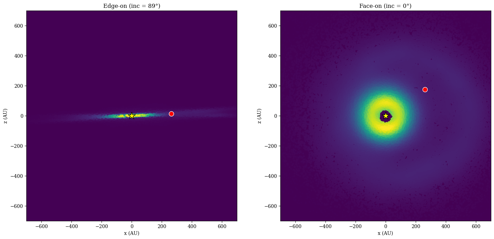

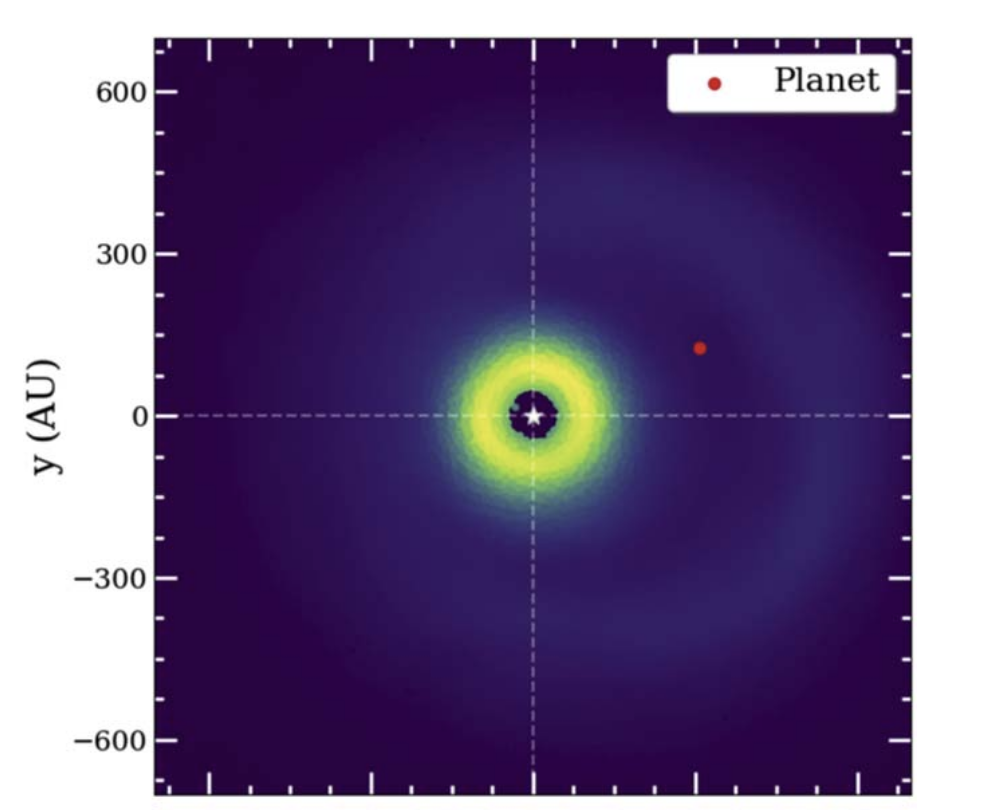

These density maps use kernel density estimation. Their colours should not be interpreted as calibrated scattered-light brightness. The scattered-light calculation is a separate step:

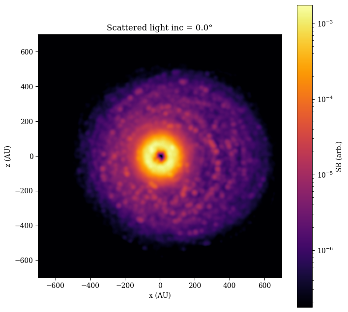

The comparison with Katie's result is now similar, though not identical. One possible source of the remaining difference is the random seed: setting the Python seed does not necessarily set the NumPy seed. I also need to keep the plotting limits consistent when comparing the two.

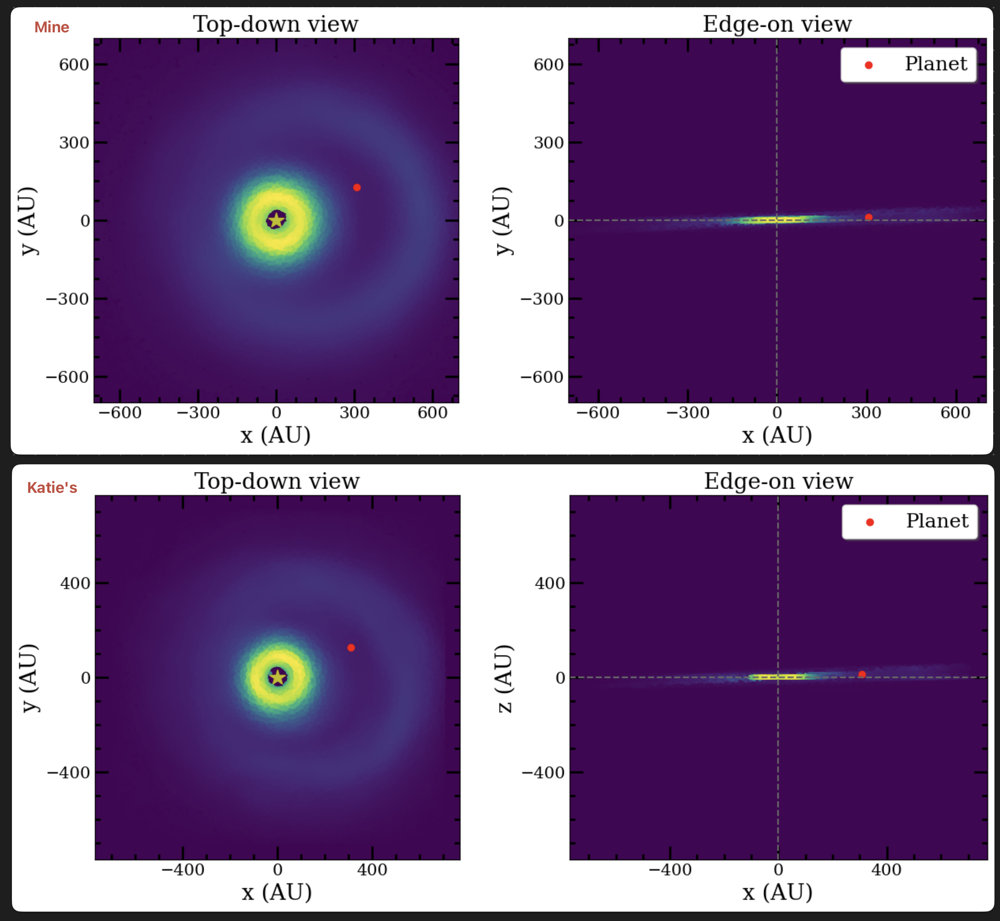

# August 2026

## 2026-08-18

### CPI paper

Ruobing shared the [CPI paper](https://arxiv.org/abs/2608.16215). Its HR 8799 planet examples are useful context for our instrument simulations. They are not a validation of our disk calculation.

## 2026-08-10

### Debris disk benchmark

The `REBOUNDx` calculation now extends to 15 Myr. The density distribution still does not reproduce the Crotts and Mathews reference closely enough. Comparing colour maps is difficult without a common scale, and smoothing the particles with a Gaussian did not by itself resolve the difference. I contacted Katie for help with the benchmark.

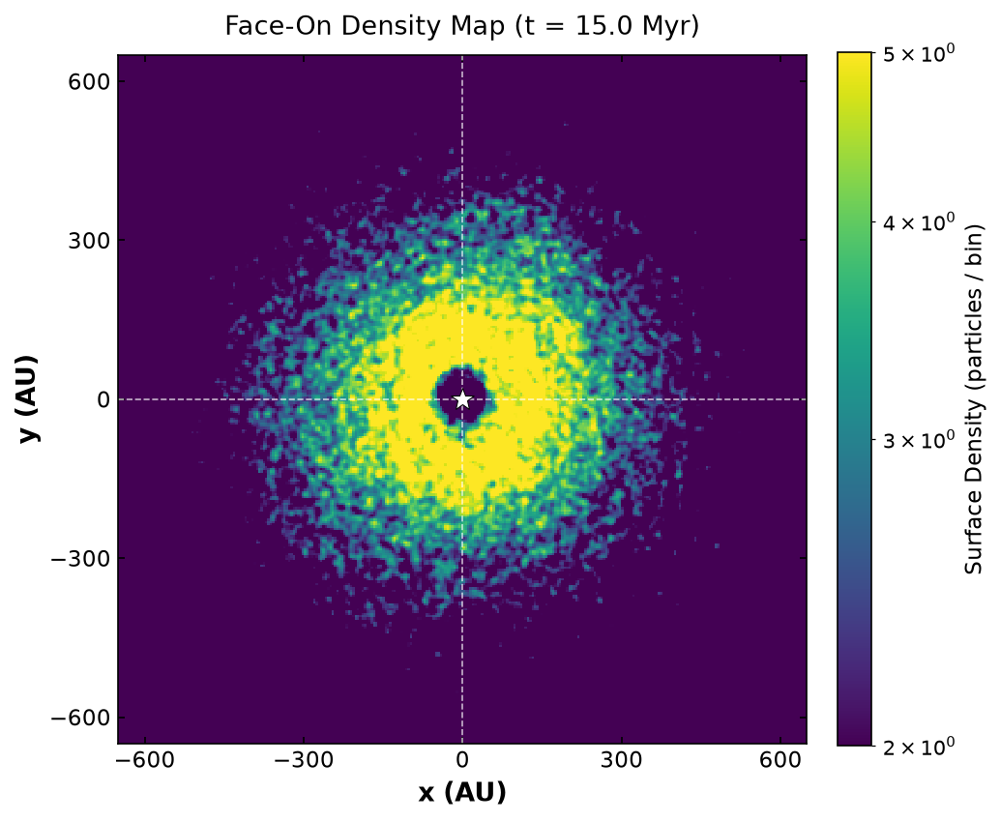

The [no-planet FITS output](../data/spiral-csst-2026-08-10-debris-no-planet.fits) shared with this test is also saved here. This is a test product, not a confirmed reproduction of the reference model.

# July 2026

## 2026-07-28

### Initial particle boundaries

The initial particle distribution between 1 and 4 AU does not impose hard boundaries on their later orbits. Particles appearing further in therefore do not automatically indicate a stacking error. I need to compare the model and reference with matching axes and units before deciding what is wrong. Some of the `MCFOST` zone settings also remain unclear.

We discussed using the live `REBOUNDx` calculation associated with Crotts and Mathews (2024) as another route to a reproducible debris disk model.

## 2026-07-24

### Stacking particles

I stacked snapshots from the 5,000-particle calculation, which has evolved for about 63 kyr, using outputs separated by 500 steps. The resulting 565 nm image still has structure that needs explaining, including emission inside 1 AU. At this point I have not established whether the problem is in the particle distribution, stacking, or radiative transfer.

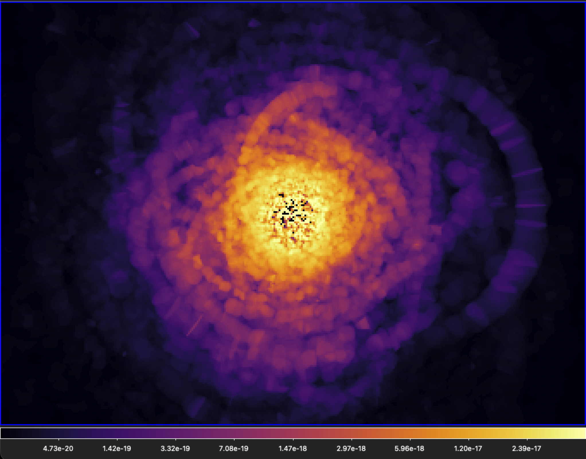

## 2026-07-13

### Sparse particles and radiative transfer

The `SMACK` to `MCFOST` calculation is not yet producing satisfactory images. Sparse particle sampling is one possible explanation, but the published example uses relatively few particles too, so this needs testing rather than assuming. The Solar System and HR 8799 calculations are running on Rorqual and Trillium respectively.

## 2026-07-07

### First debris disk images

I made demonstration images from a 10,000-particle calculation after only a few steps. These use a Henyey–Greenstein phase function with $g = 0.5$ and a scattering efficiency of unity. These are assumptions for the demonstration, not a calibrated dust model or an evolved disk result.

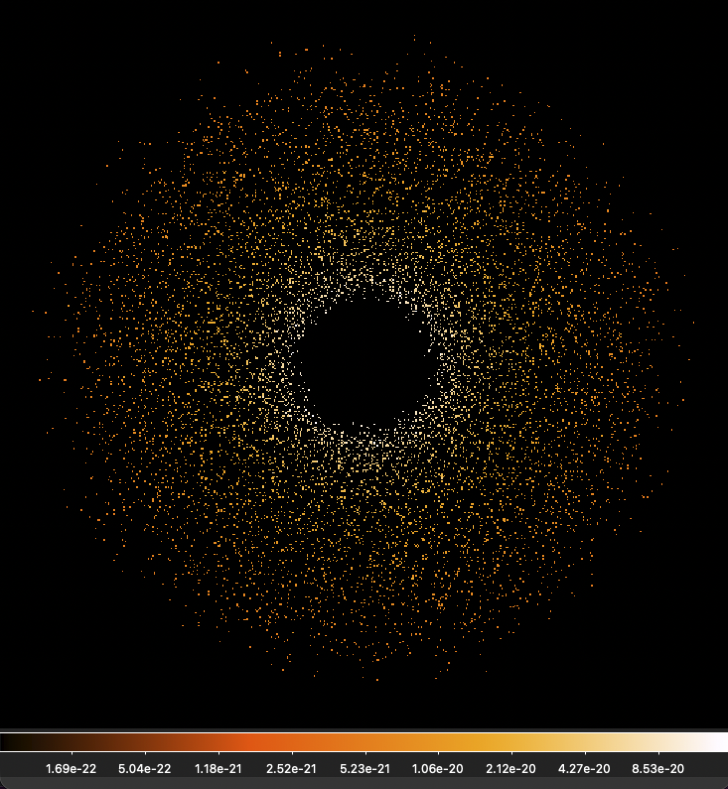

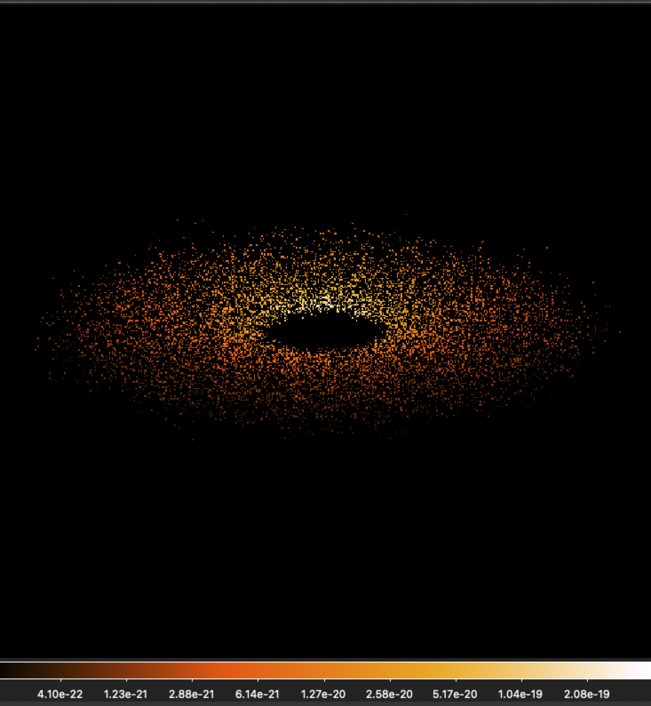

# June 2026

## 2026-06-28

### Planet mass correction

I found that the Jupiter mass scale had been set to $3 \times 10^{-4}$ instead of about $9.54 \times 10^{-4}$ in stellar mass units. The other giant planet masses had inherited this incorrect scale. The affected calculations need rerunning; the previous outputs cannot simply be relabelled as the intended Solar System model.

I also started adapting the `VIP`/`GRaTer` approach for a debris disk calculation.

## 2026-06-27

### HR 8799 and SMACK

The HR 8799 setup should use the four confirmed planets. I have run the `SMACK` examples as a starting point for the debris disk work.

## 2026-06-17

### RDI test

The instrument team reproduced the supplied inputs without identifying a script error. We are now checking the treatment of noise, phase errors, and frozen speckles. The reference differential imaging result looks suspiciously good with only five PCA samples, so it should not yet be interpreted as a reliable detection forecast.

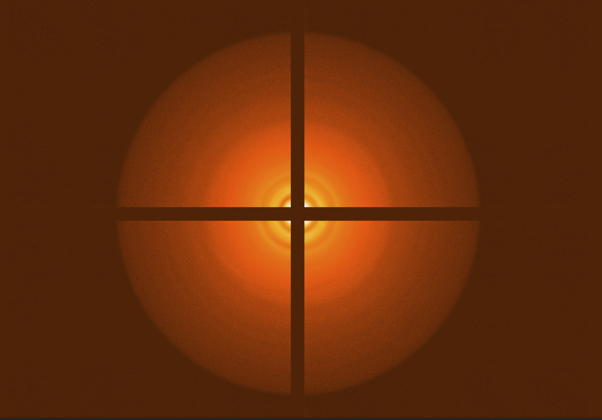

## 2026-06-12

### Workshop discussion

I presented the simulation questions at the workshop. A wider planetary system such as HR 8799 may provide a more useful illustrative case for CPI. For a protoplanetary disk example we would be borrowing its planet masses and orbital scales; that is different from modelling the actual debris disk at the system's distance.

## 2026-06-11

### Distance and the inner working angle

At 100 pc the relevant Solar System planet locations fall behind the instrument mask. Moving the same young disk to 10 pc is useful as an instrument demonstration, but it is not a realistic nearby young disk example. The RDI calculation also still needs validation before using its output as a science result.

## 2026-06-08

### Instrument noise and a debris disk direction

The output includes integer ADU values and a bias of 200. I need to understand these detector conventions and use realistic noise settings before interpreting a signal-to-noise ratio. Turning noise terms off can help diagnose the pipeline, but it does not establish detectability.

We also discussed a younger Solar System debris disk, at ages of tens to hundreds of Myr, as a possible nearby target class. Possible modelling routes include `REBOUND`, `SMACK`, `REBOUNDx`, or an optically thin calculation based on particle distributions.

## 2026-06-04

### Next temperature iteration

The next hydro iteration is running. The eventual plan is to evolve the model to 2,500 Jupiter orbits and write up the hydro and radiative transfer method while the instrument questions are being resolved.

# May 2026

## 2026-05-31

### Iterating the temperature

The initial hydro temperature at Jupiter's orbit was 73.58 K, while radiative transfer gave 43.26 K, a ratio of about 0.588. With the revised hydro temperature of 43.25 K, the next radiative transfer result is 37.03 K, giving a ratio of about 0.856. This is closer, but it is not yet an exact match.

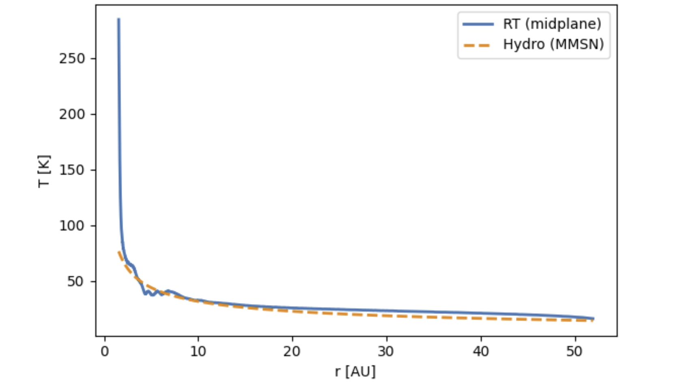

When changing the temperature slope $q$, I need to preserve the intended surface density law. For $\Sigma \propto R^{-3/2}$, the corresponding mid-plane density exponent is $p = -3 - q/2$. The MMSN surface density prescription does not itself fix the temperature profile. We also discussed filling the artificial inner cavity for radiative transfer; this still needs a clear implementation and test.

## 2026-05-30

### Writing while waiting

I can start drafting the hydro and radiative transfer sections while waiting for clarification about the CPI pipeline. The instrument uncertainty should not prevent documenting the calculations that we already understand.

## 2026-05-27

### Exposure settings

I have not found a definite pipeline bug. The current setup uses 100 exposures of 5 seconds with EM gain 50, and the 10 pc example may simply be too bright for these settings. This is a hypothesis to check with Gang, rather than an explanation established from the images alone.

## 2026-05-24

### Flux checks

The total stellar flux should be substantially larger than the disk flux, roughly by a factor of 10–100 in the comparison we discussed. The conversion and image normalization need to preserve this relationship. I also need to keep track of how the unresolved star is represented in a single image pixel.

## 2026-05-23

### Intercepted starlight

We compared opening angles of about 6.2 and 8.6 degrees. The relevant surface for intercepting starlight is the scattering surface, not simply one pressure scale height. An intercepted fraction of order $\sin\theta \sim 0.1$ makes the integrated scattered-light flux plausible, but this is only a consistency check on radiative transfer, not on the instrument simulation.

## 2026-05-22

### Brightness and temperature parameters

At 520 nm and 10 pc, the image has about 18 Jy from star plus disk and about 1 Jy from the disk alone. An integrated disk-to-star ratio is different from a surface brightness contrast in an individual resolution element, so these quantities should not be compared interchangeably.

The stellar model uses a 4,000 K blackbody, $2 R_{\odot}$ and $1 M_{\odot}$. The updated hydro parameters are $c_s^2 = 8.94 \times 10^{-4}$ at Jupiter's orbit, $q = -0.47557$, and $p = -2.7622$.

## 2026-05-21

### Tracing the bright disk

The bright disk diagnostic includes the star. I need to trace the radiative transfer output through the instrument conversion and distinguish the star-plus-disk image from the disk-only image before attributing the result to the instrument.

# April 2026

## 2026-04-14

### Temperature from radiative transfer

The radiative transfer calculation on the 800-orbit output gives an azimuthally averaged mid-plane temperature of about 43 K at Jupiter's orbit, compared with the initial value of about 74 K. The next hydro run should use the revised temperature profile.

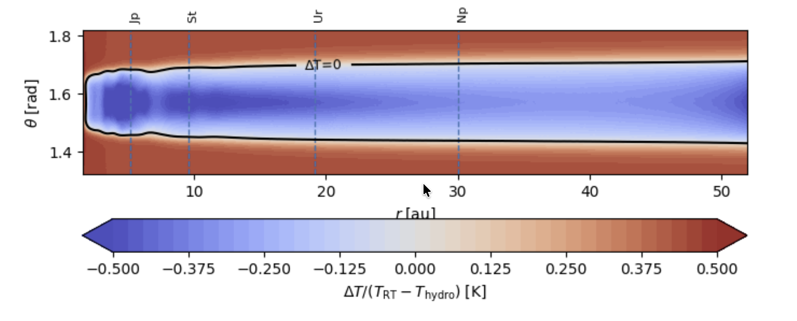

The normalization of an extended disk template in `CPISM` is still unclear, particularly how its magnitude is used. I contacted Gang to clarify this before interpreting the synthetic observations.

## 2026-04-10

### Restart and image processing

The restart worked. I am using the 800-orbit output for radiative transfer while the longer calculation continues toward 2,500 orbits. Saturn's gap develops more slowly, so the current output is still an intermediate result.

For reference differential imaging, we discussed `pyKLIP`, `PynPoint`, and `VIP`. A simple subtraction test should come before a more elaborate reduction.

## 2026-04-06

### Corrupted restart

The final restart file after roughly 700 orbits was corrupted. The remaining wall time may not have been sufficient to finish writing it, even with a 20-minute buffer, but this is not yet proven. The unexpectedly fast later evolution also needs checking. Periodic restart files saved every 50 orbits provide a way to recover from the earlier valid state.

## 2026-04-05

### Level 0 images

I generated CPI Level 0 examples at inclinations of 0, 20, 35, 55, 70, and 85 degrees, with a position angle of 45 degrees and distance of 40 pc. The resampling uses the input `CDELT1` and an instrument pixel scale of 0.01615 arcsec.

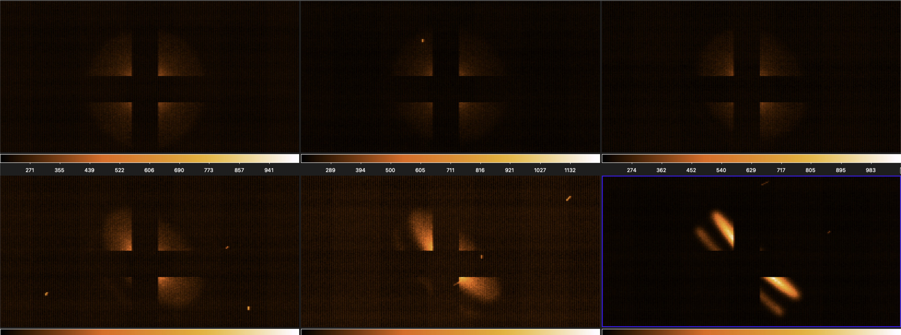

The angular scale matters immediately: Jupiter at 5.2 AU subtends only about 0.037 arcsec at 140 pc. A visible gap in the radiative transfer image may therefore lie inside the coronagraph's inner working angle.

# March 2026

## 2026-03-26

### First instrument images

The first `CPISM` outputs show the mask and noise, but they are not yet ready for a detectability claim. At 10 pc the gap is visible in the noiseless example, while the noisy image appears overexposed. I need to check exposure settings, the dark-hole treatment, and the difference between the blackbody and Kurucz stellar spectra.

## 2026-03-20

### Image units

The radiative transfer intensity must be converted to `photlam` and resampled for the correct CPI band. The inner working angle masks the Solar System features at 140 pc; the optical angular resolution helps, but does not remove that constraint. The current instrument inputs are provisional and need regenerating from the later hydro output.

## 2026-03-18

### Intermediate radiative transfer

I am using the 402-orbit output with an outer radius of 7 for a provisional radiative transfer calculation while the longer run continues. The full dust distribution makes the disk edge optically thick, which needs to be accounted for when inspecting these images.

## 2026-03-14

### Density normalization and the long run

The calculation has reached about 402 orbits. The next target is 2,500 orbits with an outer radius of 10. The density exponent for the adopted temperature law should be about $-2.78$, not the earlier $-2.25$.

An MMSN model needs an absolute surface density normalization as well as the radial slope. The Chiang and Hayashi normalizations differ, so I need to choose one consistently. For the temperature iteration, using the radiative transfer mid-plane temperature for a vertically isothermal hydro model is the working approximation; it does not mean the full radiative transfer disk is vertically isothermal.

## 2026-03-09

### Orbit units

The requested 2,500 orbits are measured at Jupiter's orbital radius. This corresponds to roughly 1,000 Saturn orbits. I need to retain this distinction when reporting how long each planet has had to open its gap.

## 2026-03-05

### Production run

The Solar System calculation is now running in restart segments to fit the eight-hour job limit. It uses 3,456 CPUs and produces output files of about 16 GB. I should retain the primitive variables needed for density and all three velocity diagnostics. The early movie has no obvious new failure, but it is still an early output.


## 2026-03-04

### Starting temperature and resolution

Using the Chiang mid-plane temperature at 5.2 AU gives $c_s \simeq 0.039$ in code units and a flaring exponent of $2/7$. A grid of $1152 \times 192 \times 2048$ is the starting point for the production calculation. The temperature will later need updating from radiative transfer rather than being treated as fixed by this initial choice.

## 2026-03-03

### Softening and cells per scale height

Switching to Rixin's softening implementation removed the problematic features in my implementation of the other prescription. This points to an implementation issue; it is not evidence that the published prescription is wrong. The numerical concentration around Saturn and its interaction with the gap also improved.

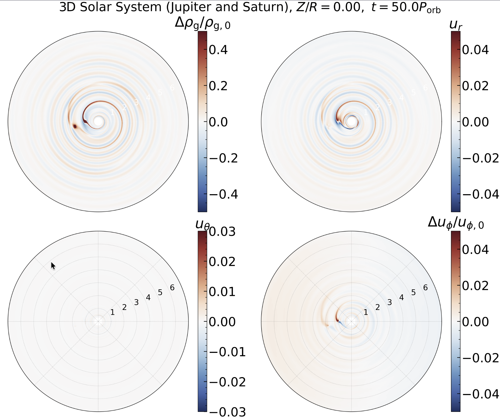

I corrected the calculation of cells per scale height on the logarithmic grid and checked all three directions. The sound speed also needs evaluating at 5.2 AU, rather than carrying over the normalization at 100 AU.

## 2026-03-01

### Analytical inner radius

The $R_{\star}$ in the analytical accretion solution is not automatically the numerical inner boundary. For the point-mass model, taking $R_{\star} = 0$ gives the appropriate comparison here. With the adopted constant $\nu/R$, the corresponding radial velocity is constant. Substituting the grid's inner radius changes the analytical profile and can make a correct numerical result look wrong.

# February 2026

## 2026-02-25

### Comparing radial velocities

The radial velocity inferred from mass flux and the mass-weighted radial velocity agree more closely away from the inner boundary. The analytical comparison needs to use the quantity actually represented by the simulation diagnostic; a mid-plane slice and a vertically integrated accretion rate are different measurements.

## 2026-02-24

### Polar resolution

The $720 \times 256 \times 192$ calculation no longer shows the same sudden inner jump. I also fixed the ghost-zone reader. A separate indexing error was producing zeros in the mass-weighted velocity and mass flux calculation, so those earlier diagnostic values were not reliable.


The mid-plane density and the column density can evolve differently. I need to inspect the vertical distribution instead of interpreting a mid-plane decrease as loss of the entire column.

## 2026-02-23

### Long planet-free test

The long test extends to 2,000 orbits, with the initial adjustment settling after roughly 80. The inner mid-plane density falls while the surface density increases. This makes a vertical slice particularly important for understanding where the gas has moved.

## 2026-02-22

### Initial, ghost, and damping states

The initial conditions, ghost values, and damping targets contain separate expressions, spread over nine places in the implementation we were checking. Updating one does not automatically update the others. I need to change them deliberately and preserve the source, executable, and input used for each run so that the comparison is reproducible.

## 2026-02-21

### Boundary controls

The physical ghost cells retain their prescribed initial values, but the adjacent active cells still jump. The initial density and azimuthal velocity checks agree to very small relative differences between the layers, around $10^{-11}$ in the comparison. The next controls use an inviscid disk, zero initial radial velocity, and a long run with damping strength 1 and the inner damping region extending to 0.49.

## 2026-02-20

### Simplifying the mesh

Using a single mesh block across the radial direction makes the physical boundary and ghost cells easier to inspect. This should help separate a physical boundary issue from a reader or mesh-block bookkeeping issue.

## 2026-02-19

### Exponential damping test

The exponential update fixes the overshoot in the 2D test even with a diagnostic damping strength of 100. Transferring it to 3D does not by itself remove the inner ring. The large value is a stress test; the ordinary comparison should use a strength around 1. Extending the inner damping region to 0.49 still leaves it well inside Jupiter's approximate gap range of 0.8–1.2.


## 2026-02-18

### Damping strength and overshoot

I had interpreted `damping_rate` backwards: it controls the strength, not a relaxation timescale. With a large strength, the linear update can overshoot the target. An exponential relaxation instead uses

$$
\Delta q = (q_0-q)\left(1-e^{-\alpha}\right),
$$

where $\alpha$ here is the dimensionless damping factor, not the viscosity parameter. I also fixed an ordering error in the implementation.

## 2026-02-17

### Testing the damping target

If the disk and damping target already have the same steady values, a comparison may not reveal whether damping is working. I need to perturb the target deliberately and compare outputs at matching physical times.

## 2026-02-16

### Back to three dimensions

The improved 2D calculation does not settle the 3D problem. The planet-free 3D disk still develops an inner feature, so it needs its own controlled boundary and damping tests.

## 2026-02-12

### Resolving the inner disk

A logarithmic grid with finer inner cells removes the cavity in this test. The earlier `x1rat = 1.002` setup had only about 90 cells in the region being compared. This reinforces the need to compare actual cell sizes, rather than treating a grid ratio or total cell count as sufficient evidence of resolution.

## 2026-02-10

### Correcting the 2D density profile

The 2D setup had inherited the 3D density exponent of $-9/4$, even though the 2D variable represents surface density. Correcting this substantially improves the 2D result. Rixin's viscosity implementation in the custom fork is consistent with the implementation Yu supplied. Neither observation, by itself, establishes that the remaining 3D boundary problem is fixed.


## 2026-02-09

### Propagating boundary disturbance

The measured propagation speed is about 0.11, compared with a sound speed around 0.13. This is consistent with a sound wave launched near the boundary. Comparing the viscosity implementations remains useful, but we have not established a viscosity bug from this behaviour.

## 2026-02-08

### Longer boundary tests

The 200-orbit comparisons with different damping choices still do not reproduce the expected radial velocity everywhere. The next distinction is whether a feature is a transient adjustment or a persistent departure from the intended steady state.

## 2026-02-07

### Physical time and the revised 2D model

One time step on two different grids does not represent the same physical duration. The time step changes with resolution, so the early outputs need comparison at matching physical times. Yu supplied a revised 2D setup with the surface density and viscosity specified explicitly, without damping the azimuthal velocity. We also discussed longer ghost-zone and damping tests.

## 2026-02-03

### Reproducible comparison

I prepared the complete inputs for the three radial domains to share with Yu. The 3D calculation still develops a cavity with damping present. The comparison needs the actual generator and inputs, not only plots of the resulting density.

## 2026-02-02

### Matching cells between domains

Equal numbers of cells over different radial domains do not give equal resolution. With matching cell spacing, the inner profiles overlap much more closely. A disturbance crossing a similar number of pixels is also not necessarily crossing the same physical distance.

## 2026-02-01

### Ghost values and domain tests

The ghost values remain fixed at their initial state in the check. Tests on the radial ranges $[0.3,1.5]$ and $[1.5,7]$ both show inner-boundary behaviour, and Yu's setup shows a similar issue in the comparison. This narrows the problem, but does not yet identify the final cause.

# January 2026

## 2026-01-31

### First active cells

The first active cells develop a large inward radial velocity and drain faster than they are supplied. I am comparing three domains with matching cell sizes and using the cylindrical 2D generator supplied by Yu to simplify the problem.

## 2026-01-30

### Radial spacing

Changing the disk extent requires reconsidering `x1rat`; otherwise the comparison also changes the radial spacing. The revised spacing improves the density behaviour, but the radial velocity is still not right. A cylindrical 2D test should make the next boundary checks easier.

## 2026-01-29

### Reducing the boundary problem

The simple hypothesis that the damping region suddenly fails below one cell is not supported by the tests: the behaviour changes gradually. The next step is a 2D calculation with one mesh block and outputs at $t=0$, $dt$, and $2dt$.

## 2026-01-28

### Cavity controls

Changing the disk extent affects the cavity, whereas reducing the disk mass does not remove it. Increasing resolution helps even without a planet. We considered whether the damping region was insufficiently resolved, but that still needs a controlled test.

## 2026-01-27

### A cavity without planets

The cavity also forms in the no-planet calculation. Reflecting boundaries produce an overdensity, while outflow boundaries have their own problems; setting the initial radial velocity to zero does not remove the behaviour. This means the planet potential is not required to produce the cavity.

The small restricted three-body experiment is useful for understanding trajectories, but does not validate the hydrodynamic disk calculation.

## 2026-01-26

### Reference velocity and reference frame

Subtracting a different reference velocity from a plot is not the same operation as transforming the simulation into the centre-of-mass frame. I need to keep those two questions separate. The growing inner cavity should first be tested without planets to isolate the boundary behaviour.

## 2026-01-22

### Dust input and the inner cavity

Rerunning the radiative transfer calculation with the intended 10 percent dust case corrected the earlier input mistake. I checked the dust grid and density mapping as well.

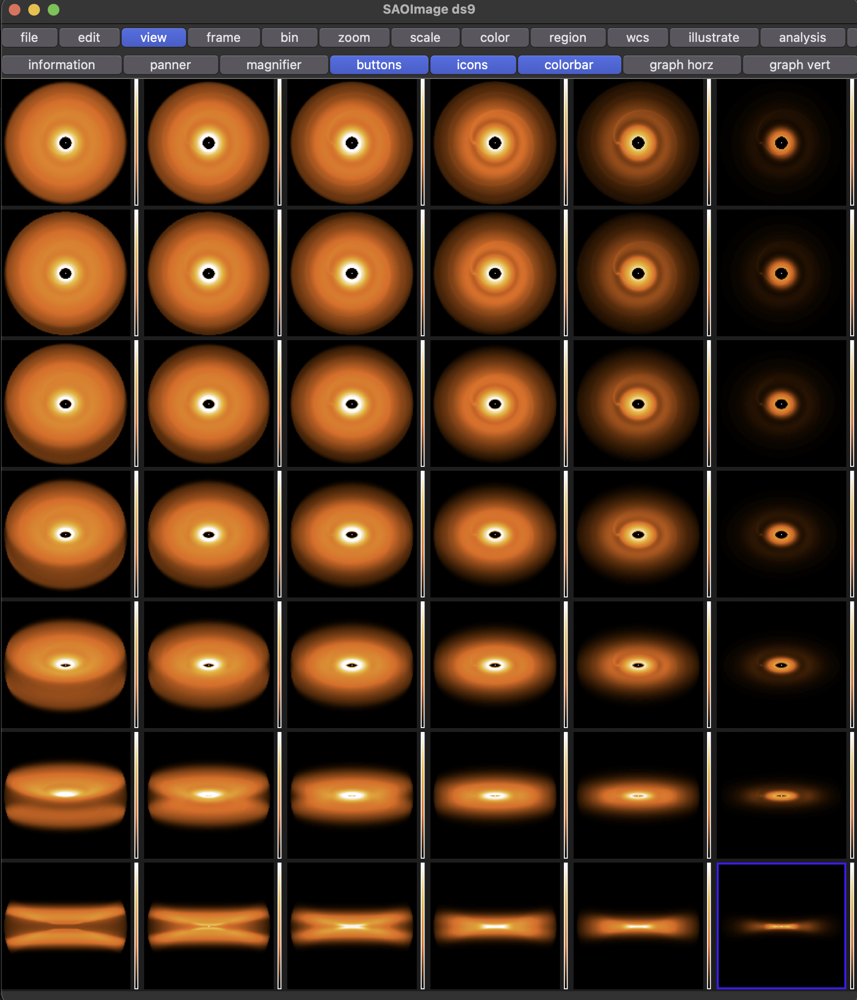

The hydro inner cavity is still unresolved. A time sequence should show whether the disturbance starts at the boundary and propagates out. Moving planet masses into the input parameters will also make the control runs easier without recompiling for each mass choice.

## 2026-01-21

### Multiple planets

The first multi-planet setup places the giant planets at code radii 1, 1.84, 3.69, and 5.78. I found that the orbital radius was being multiplied twice in the softening calculation and corrected it. The high density around the lower-mass Saturn still needs a control with all other planet masses set to zero. A numerical concentration inside the softened potential should not be described as a resolved planetary atmosphere.

The radiative transfer outputs for two dust fractions also looked unexpectedly similar, so I need to verify that the intended inputs actually reached the calculation.

## 2026-01-20

### Vortices and libration

There is no obvious vortex in the surface density. Closed streamlines near the planet's leading and trailing 60-degree locations can represent L4/L5 libration, so they are not sufficient evidence of a vortex. This requires the correct velocity reference, adequate resolution, and a more appropriate diagnostic such as vortensity.

The next model will use four giant planets on prescribed Keplerian orbits, without accretion or mutual planet interactions. The softening should be tied consistently to the Hill radius.

## 2026-01-19

### Dust fraction controls

I tested a dust fraction of 1 percent. The opacity choice also changed, including the use of standard DSHARP material with ice and DHS, so this is not yet a clean dust-fraction comparison. To isolate the dust amount, I need to hold the opacity model fixed.

## 2026-01-18

### Inclination sequence

The hydro calculation has reached 500 orbits. I made an inclination sequence from the radiative transfer output after trying the DSHARP opacity without ice. Some structures looked like possible vortices, but that interpretation has not been established from the hydro diagnostics.


## 2026-01-16

### First scattered-light image

The first local radiative transfer image is noisy and uses a low-resolution calculation. It is total intensity, whereas the comparison we want involves polarized intensity, so the two should not be compared directly. We also discussed connecting the model images to the instrument simulation pipeline.

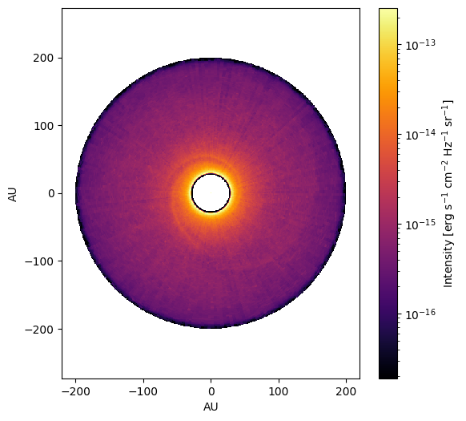

## 2026-01-14

### Higher resolution and ghost checks

The higher-resolution result looks better. I checked the required symmetric and antisymmetric velocity behaviour in the ghost cells numerically, and the density does not show the same sharp jumps in those checks. The full evolution and the large velocities near the planet still need inspection; the target is a 500-orbit run.

## 2026-01-13

### Cluster run

The cluster job is running without producing the expected output, while the CPUs appear idle. I need support to diagnose this; there is not yet a confirmed explanation for the stalled calculation.

## 2026-01-12

### Polar boundary checks

I updated the polar boundary implementation using Bae's setup. The large near-planet polar velocities still require checking, including the average of the cells on either side of the mid-plane and the actual ghost values. A possible connection to the planet mass ramp is still only a hypothesis.

## 2026-01-11

### Correcting the perturbation plots

The density perturbation had its sign reversed. The azimuthal velocity diagnostic also normalized a residual velocity by another small residual when `orbital_system` was enabled. It should use the actual initial full azimuthal velocity for the intended fractional perturbation. I corrected these plots before using them to judge the model.

## 2026-01-10

### Velocity scales

Small polar velocities also appear in the published exoALMA outputs. Their meaning depends on the plotted scale, height, and time. A nearly blank plot does not prove the velocity is zero, and a stretched colour scale does not prove that a small feature is dynamically important.

## 2026-01-09

### Potential implementation errors

An `OR` versus `AND` error meant the gravity order was always set to 2. Differences I had attributed to changing that order must therefore have come from another parameter or executable change. I also found a softening normalization error: the value 0.024 was already a length and should not have been scaled a second time as though it were a Hill-radius coefficient.

## 2026-01-07

### Preparing radiative transfer

I started the conversion from the Athena output to the `RADMC-3D` grid and density input. The mapping, dust prescription, and opacity files need checking before the first images can be interpreted.

## 2026-01-05

### Viscosity and cooling tests

The viscosity comparisons suppress the VSI-like structure. A cooling test with $\beta = 1$ also removes that appearance, though other perturbations remain. When combined with a viscosity of $\alpha = 5 \times 10^{-3}$, the viscous effect dominates this comparison. These tests do not yet define a resolution-independent threshold.

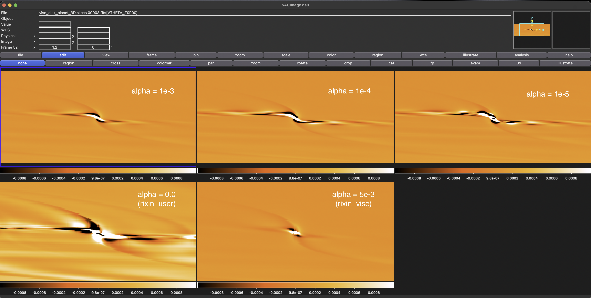

Including ghost outputs also exposed mesh-block features in the diagnostic data. Those need separating from physical structures in the disk.

## 2026-01-03

### Possible VSI

Rixin identified the vertical structure as consistent with the vertical shear instability. I am testing viscosity values including $10^{-5}$, $10^{-4}$, and $10^{-3}$. The number of cells per scale height matters for interpreting whether a feature is resolved. Flexible FITS scaling is useful for finding weak early disturbances, but their amplitude still needs to be reported honestly.

## 2026-01-02

### Locally isothermal setup

I had confused the globally isothermal build option `--eos=isothermal` with the locally isothermal treatment controlled by `Isothermal_Flag`. The latter needs the appropriate pressure and energy treatment. Correcting the setup removed the outer azimuthal velocity features, although the longer evolution still develops vertical structure.

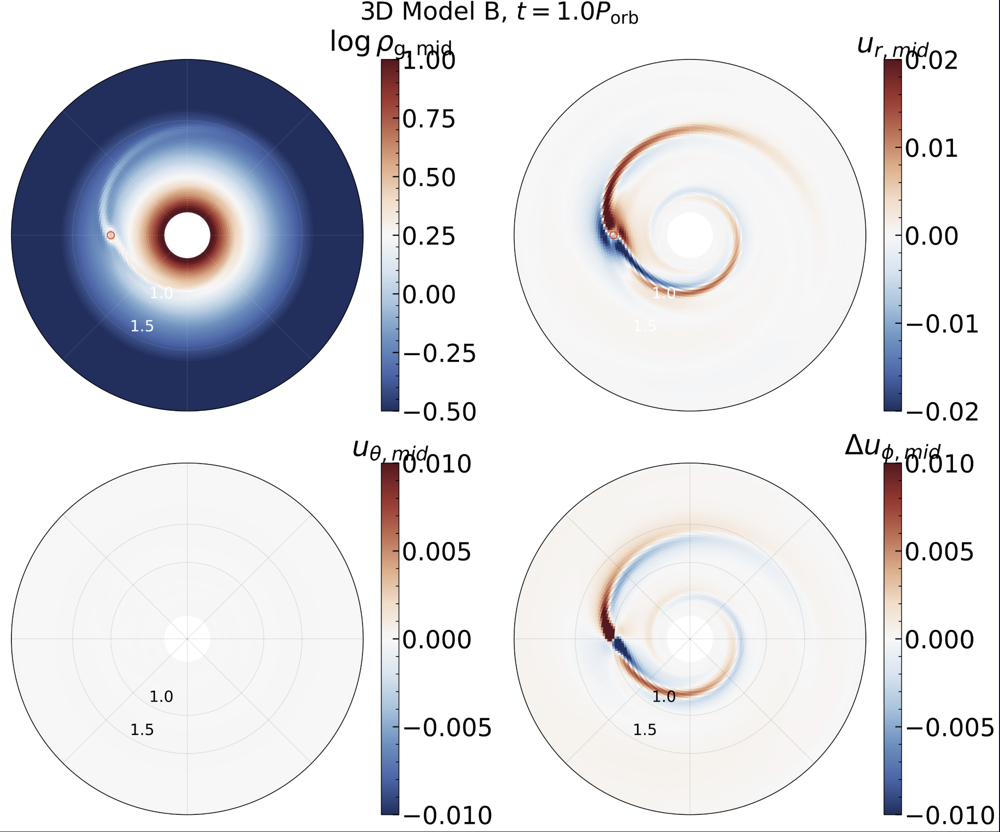

The boundary tests should include the actual ghost data. I also need to retain the executable, source, and input together for each run, otherwise apparently controlled comparisons can mix different implementations.

# December 2025

## 2025-12-31

### Dong and Fung comparison

I attempted the 1MJ-H10 model from Dong and Fung (2017). The qualitative shapes look promising, but rings appear as early as the first orbit, and the azimuthal velocity offset and boundary behaviour still need explaining. A visual resemblance is not enough; the comparison needs quantitative checks.

## 2025-12-29

### A simple gas model first

The immediate goal is a gas model suitable for synthetic images, starting from the Dong and Fung (2017) baseline. Additional features should be introduced when the science needs them. We have not demonstrated that the scattered-light images are insensitive to thermodynamics, so that cannot be used to dismiss a hydro inconsistency.

## 2025-12-28

### Refinement boundaries and the mid-plane

The sharp features near $r \simeq 0.78$ and $1.76$ coincide with static mesh refinement boundaries, as Rixin confirmed. Only level 0 covers the full radial grid. I removed dust and refinement to simplify the comparison.

The nonzero mid-plane polar velocity was also partly a sampling issue: taking the nearest cell does not sample the mid-plane itself. Averaging the two symmetric cells fixes that diagnostic. The azimuthal reference velocity needs to be consistent too. For the inertial-frame movie, outputs at integer orbital periods avoid the apparent jumps in planet position.

## 2025-12-27

### Start from an unchanged example

My earlier simplification of Rixin's generator introduced additional bugs. I should first run the exact working example unchanged, establish that it reproduces the expected result, and only then change one feature at a time.

## 2025-12-26

### Generator and reader checks

We decided to use Rixin's working generator as the baseline because there are too many interacting problems in my original setup. The exoALMA reader also applies a hard-coded `Omega0` correction appropriate to those outputs, which is not automatically appropriate to mine. A plotting script working on a reference dataset does not validate every assumption it makes for a new run.

The initial perturbations should be measured against the actual $t=0$ output of the same simulation, rather than a copied reference profile.

## 2025-12-25

### See Different things

Also it goes without saying that we need to look at different (all) diagnostics available to us. Looking just at density outputs may not always provide the full picture. Each other output (the three velocities, for instance) may provide some hint of what is going wrong. Developing an aptitude to study the outputs and knowing what is going wrong is as important as knowing how to run a model correctly.

### Frame and plotting corrections

I corrected a plotting issue that made the planet appear slightly displaced from $r=1$, and a mismatch between the inertial-frame planet acceleration and co-moving gas acceleration. The apparent azimuthal motion is gone, but the outer patterns remain and the expected spiral arms are missing in the new movies. These corrections have therefore not produced a usable run yet.

The HDF5-to-FITS conversion and movie workflow are now in place. The next comparison is a planet-free disk, with density and all three velocities inspected from the first few time steps.

## 2025-12-21

### More problems

One tip I got to know was to try seeing the outputs after and at initial time steps ($dt, 2dt, 3dt, \ldots$) as they allow us to see if things are going immediately wrong (they usually do) and how it's going wrong at those initial time steps often helps to understand what exactly the problem is, especially when we are not sure and there are too many parameters to consider. Also view them in DS9 instead of making unwieldy `matplotlib` images.


Another example of things going wrong. This times, likely some problem in the implementation of planet potential. Also, the movement of the planet in the azimuthal direction also means I am not calculating the planet position correctly to apply its gravity.


## 2025-12-13

### Units and short control runs

With $G=M_{\star}=1$, a velocity of 1 is the Keplerian velocity at $r=1$. The large velocities in the current outputs are therefore not reasonable merely because they are expressed in code units. Ruobing suggested setting the final planet mass to zero and inspecting $t=0$, one step, and two steps before committing to a long run. Spiral structure can appear after a few orbits; the first diagnostic does not need to wait for the 500-orbit endpoint.

## 2025-12-12

### Boundary problems


Above is an example of things going wrong. The straight line slightly beyond $r = 2.5$ implies a circle in the Cartesian coordinates. The velocities with opposite signs on the two sides means gas is moving away from that circle on both sides which would produce a vacuum at that location. In other words, this is a good example of boundary conditions being not set correctly.

The steps to debug and sort out the problem are same as I'm already familiar with. Start with simple and most basic *reduced* form of the actual problem. Gradually add complexity, one at a time. See how things change. 
## 2025-12-11

### Leaky Gaps

Rixin Li has kindly hosted a tutorial on how to run hydro models with `Athena++` at his [webpage](https://rixinli.me/LeakyGaps/). This includes instructions to run/compile the code, as well as how to setup problem generators and even provides additional scripts to analyze, process and visualize the simulation data in a better way.

## 2025-12-05

### A writeup

The first step is to setup the problem generator file. For our problem, we need to define following interface functions manually:
```cpp
// This routine does two things: first is to read/parse the accompanying input file 
// and then enroll our custom defined source function (which in our case is the 
// planet-disk interaction) and BCs.
void Mesh::InitUserMeshData(ParameterInput *pin)

// This will be the core function that will setup the ICs.
void MeshBlock::ProblemGenerator(ParameterInput *pin)
```

### Initial conditions

First step, is to setup the density which is given by:

$$
\rho (R, Z) = \rho_p \left(\frac{R}{R_p}\right)^p \exp \left(\frac{GM_{\star}}{c_s^2} \left[\frac{1}{\sqrt{R^2+Z^2}} - \frac{1}{R}\right] \right)
$$

where $p = -2.25$. I assumed $GM_{\star} = 1$, as that seems logical given we are using *code units*. For $\rho_p$, we need to enforce the constraint that the total disk mass yields $0.01 M_{\odot}$ (although in *code units* might not be necessary?). I used $R_p = \sin \theta$, given $r = 1$ seems obvious from figures (1-4) of the paper as well, written explicitly for the SPH simulation. Further, as planet is supposed to be at mid-plane, $\theta = \frac{\pi}{2} \implies R_p = 1$. For sound speed, we can use the fact that they use vertically isothermal disk, so

$$
\begin{split}

P & = \rho c_s^2 \\

\implies c_s^2 & = \frac{P}{\rho} = kT \\

\implies c_s^2 & \propto T

\end{split}
$$

Now, we know,

$$
H = \frac{c_s}{\Omega_K}, \quad \Omega_K = \sqrt{\frac{GM_{\star}}{R^3}}
$$

we can use the temperature profile to find $c_s$:

$$
\begin{split}

T(R) & = T_p \left(\frac{R}{R_p}\right)^q, \quad q = -0.5 \\

\implies c_s (R) & = c_{s,p} \left(\frac{R}{R_p}\right)^{q/2} = c_{s,p} \left(\frac{R}{R_p}\right)^{-0.25}

\end{split}
$$

They chose $T_p$ such that:

$$
\begin{split}

\frac{H}{R} \bigg|_{R=R_p} & = 0.1 \\

\implies H_p & = 0.1 R_p

\end{split}
$$

which means

$$
c_{s,p} = H_p \Omega_K (R_p) = 0.1 R_p \sqrt{\frac{GM_{\star}}{R_p^3}} = 0.1 \sqrt{\frac{GM_{\star}}{R_p}}
$$

And, I think to get the final expression for $T_p$, we can absorb the value of the constant factor in *code units* again, which gives us $T_p = 0.01$. Finally, we can also get an expression for aspect ratio:

$$
\begin{split}

\frac{H(R)}{R} = \frac{c_s (R)}{\Omega_K} \cdot \frac{1}{R} & = c_{s,p} \left(\frac{R}{R_p}\right)^{q/2} \cdot \frac{1}{\Omega_K} \cdot \frac{1}{R} \\

& = c_{s,p} \left(\frac{R}{R_p}\right)^{q/2} \cdot \sqrt{\frac{R^3}{GM_{\star}}} \cdot \frac{1}{R} \\

& = 0.1 \sqrt{\frac{GM_{\star}}{R_p}} \left(\frac{R}{R_p}\right)^{q/2} \cdot \sqrt{\frac{R}{GM_{\star}}} \\

& = 0.1 \left(\frac{R}{R_p}\right)^{(q+1)/2} \\

\end{split}
$$

### Source function

This sets the ICs. Next, we need to set up the planet-disk source function. In the `athena++` wiki, this is the place where we can update the conserved variables at each time step, like momentum and energy, but because we are using isothermal EOS, we need to worry only about momentum.

```cpp
void MySource(MeshBlock *pmb, const Real time, const Real dt,
		const AthenaArray<Real> &prim,
		const AthenaArray<Real> &prim_scalar,
		const AthenaArray<Real> &bcc,
		AthenaArray<Real> &cons,
		AthenaArray<Real> &cons_scalar);
```

As I understand, for our case, I can just update the momentum by using the momentum density:

$$
\begin{split}  
\mathbf{m}  
&= \rho \mathbf{v} \\  
\implies \frac{d(\rho \mathbf{v})}{dt}  
&= \rho \frac{d\mathbf{v}}{dt}  
+ \mathbf{v} \frac{d\rho}{dt} \\  
&= \rho \mathbf{a}  
\end{split}
$$

where $\mathbf{a} = -\nabla \Phi_p$ and $\Phi_p$ is given by equation (4) in the paper. Under our *code units*,  $(G = 1)$, so I can just use the planetary mass at that instant to get the potential. As density is not going to change with time (except from fluxes), that term goes away. Finally,

$$
\begin{split}  
\mathbf{a}  
&= - \nabla \Phi_p \\  
&= - \frac{d\Phi_p}{dr} \, \nabla r \\  
&= - \frac{d\Phi_p}{dr} \, \frac{\mathbf{s}}{r} \\  
&= - \frac{d}{dr} \left(-\frac{GM}{r}\right) \frac{\mathbf{s}}{r} \\  
&= GM \frac{d}{dr} \left(r^{-1}\right) \frac{\mathbf{s}}{r} \\  
&= - \frac{GM}{r^3} \mathbf{s}  
\end{split}
$$

### Boundary conditions

From what I understand, for the radial direction, the authors have adopted *symmetric* BC, which I think `athena++` calls *reflective*. But instead of reversing sign, they use damping zones, which I think is similar to *outflow* BC. So I am not sure which one to use. I implemented the damping zones in the source function itself.

For meridional direction, we need to implement a custom BC, as given by equation (9) of the paper:

$$
\begin{split}  
\frac{1}{\rho} \cdot \frac{\partial}{\partial \theta}  
\left(\rho c_s^2\right)  
&= \frac{v_{\phi}^2}{\tan \theta} \\  
\implies \frac{c_s^2}{\rho} \cdot \frac{\partial \rho}{\partial \theta}  
&= \frac{v_{\phi}^2}{\tan \theta} \\  
\implies \frac{1}{\rho} \cdot \frac{\partial \rho}{\partial \theta}  
&= \frac{v_{\phi}^2}{c_s^2} \cdot \frac{1}{\tan \theta} \\  
\implies \frac{\partial}{\partial \theta}  
\left(\ln \rho\right)  
&= \frac{v_{\phi}^2}{c_s^2} \cdot \frac{1}{\tan \theta}  
\end{split}
$$

Now, we can integrate from active cell to ghost cell:

$$
\ln \rho(\theta_g) - \ln \rho(\theta_a)  
=  
\int_{\theta_a}^{\theta_g}  
\frac{v_{\phi}^2}{c_s^2}  
\cdot  
\frac{1}{\tan \theta}  
\,\mathrm{d}\theta
$$

For thin disk approximation, $\theta$ is small, so $\tan \theta \approx \theta$. Initially, $v_{\phi} = R\Omega$, and from paper's equation (3), $\Omega$ varies as $\propto (Z/R)^2$ as we move away from mid-plane. With $Z = r \cos \theta$, we get $\Delta Z \sim r (-\sin \theta) \Delta \theta$. Therefore, for small $\Delta \theta$, overall, $v_{\phi}$ also does not change much. In which case, we can simplify the integral as:

$$
\ln \rho (\theta_g) - \ln \rho (\theta_a) = \frac{v_{\phi,a}^2}{c_{s,a}^2} \cdot \frac{1}{\tan \theta_a} \cdot \int_{\theta_a}^{\theta_g} \mathrm{d}\theta
$$

Note I use the values of active cell as we are integrating from active to ghost cell and $\theta$ is small, *with respect to*, $\theta_a$. Integration of $\mathrm{d}\theta$ is trivial, which gives:

$$
\begin{split}  
\ln \left(\frac{\rho_g}{\rho_a}\right) & = \frac{v_{\phi,a}^2}{c_{s,a}^2} \cdot \frac{\Delta \theta}{\tan \theta_a} \\  
\implies \rho_g & = \rho_a \cdot \exp \left(\frac{v_{\phi,a}^2}{c_{s,a}^2} \cdot \frac{\Delta \theta}{\tan \theta_a}\right)  
\end{split}
$$

And for the azimuthal direction, I think *periodic* BC over the whole $\phi$ domain makes sense. For traversing the cells, I referred to the `athena++` wiki page on BCs.

### Azimuthal velocity in case of FARGO

In orbital advection runs, that is with FARGO enabled, the $v_{\phi}$ written to the output files is azimuthally averaged background velocity subtracted value. Let us calculate this azimuthally averaged background velocity. From Rixin's notes accompanying the plotting notebook, the background velocity is given by:

$$
v_{\phi, \text{bg}} = \sqrt{\frac{1}{r}} \sqrt{1 - \frac{11}{4} h^2} - v_{\text{fargo}}
$$
### A small note

The exoALMA paper also did not specify what order of orbital advection (FARGO) they used, so not sure which to use.

## 2025-12-03

### Baseline

The work of [@bergez2022constraining] forms one of our baselines. The thing to keep in mind is *images of the Solar System's natal protoplanetary disk*. We don't deal with dust-gas dynamics, just gas dynamics. And instead of looking in the ALMA range of mm/sub-mm, we are going to look in optical/infrared. This is perhaps the right time to introduce [Xuntian](https://en.wikipedia.org/wiki/Xuntian), or the [[The Chinese Space Station Survey Telescope (CSST)|Chinese space station survey telescope]] (CSST), the telescope that we will be targeting. 

## 2025-12-02

### Small jobs

When testing setups, especially for hydro models, it's always nice to test with smaller resolution models. They are faster to solve!

## 2025-12-01

### The exoALMA data

The data provided by [@bae2025exoalma] is available on the [web](https://dataverse.harvard.edu/dataset.xhtml?persistentId=doi:10.7910/DVN/HE8DXM). A good starting point was to obviously see if I can at least recreate the plots from the paper, from the paper's data. 
# November 2025

## 2025-11-29

### Project start

Setting up `Athena++` on my local machine and familiarizing myself with the usual workflow. The [official wiki](https://github.com/PrincetonUniversity/athena/wiki) hosted on GitHub is actually the best resource for getting accustomed to the codebase. But of course, for any meaningful simulations, one needs a distributed HPC cluster. Working with HPC means to learn how to submit and run jobs on a system whose resources are shared simultaneously by many. Resources for those:
1. [A bit on `sbatch`](https://docs.alliancecan.ca/wiki/Running_jobs#Use_sbatch_to_submit_jobs)
2. [A bit on job scheduling](https://docs.alliancecan.ca/wiki/Job_scheduling_policies)
3. [A bit on storage policies](https://docs.alliancecan.ca/wiki/Storage_and_file_management)

In the end, each cluster might have their own set of policies. Always refer to the documentation!
